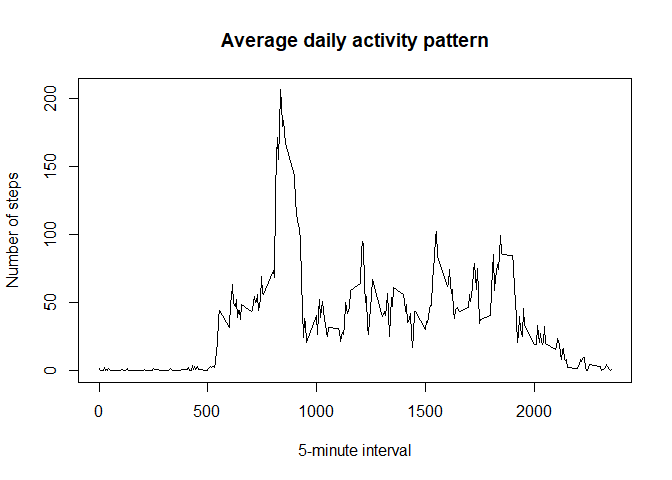
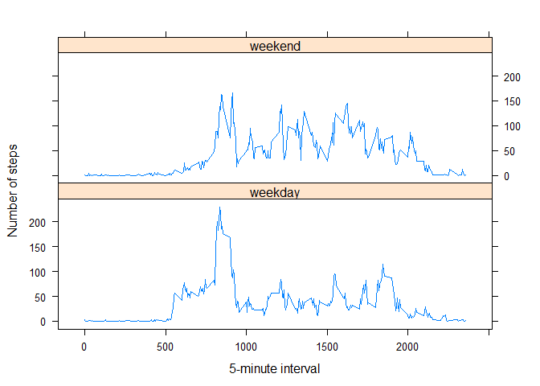

## Loading and preprocessing the data


```r
data <- read.csv(unz("activity.zip", "activity.csv"), header=T, colClasses = c("numeric", "Date", "numeric"))
print(summary(data))
```

```
##      steps             date               interval     
##  Min.   :  0.00   Min.   :2012-10-01   Min.   :   0.0  
##  1st Qu.:  0.00   1st Qu.:2012-10-16   1st Qu.: 588.8  
##  Median :  0.00   Median :2012-10-31   Median :1177.5  
##  Mean   : 37.38   Mean   :2012-10-31   Mean   :1177.5  
##  3rd Qu.: 12.00   3rd Qu.:2012-11-15   3rd Qu.:1766.2  
##  Max.   :806.00   Max.   :2012-11-30   Max.   :2355.0  
##  NA's   :2304
```

## What is mean total number of steps taken per day?


```r
dailySteps <- aggregate(data["steps"], by=data["date"], FUN = sum, na.rm = TRUE)
hist(dailySteps$steps, main="Total number of steps taken each day",
     xlab = "Number of steps")
```

<!-- -->

```r
mean <- mean(dailySteps$steps)
median <- median(dailySteps$steps)
```

The mean and median total number of steps taken per day are 9354.2 and 10395, respectively.

## What is the average daily activity pattern?


```r
intervalsAvg <- aggregate(data["steps"], by=data["interval"], FUN = mean, na.rm = TRUE)
plot(intervalsAvg, type="l", main="Average daily activity pattern",
     xlab = "5-minute interval", ylab = "Number of steps")
```

<!-- -->

```r
maxInterval <- intervalsAvg$interval[which.max(intervalsAvg$steps)]
```
The 5-minute interval, on average across all the days in the dataset, containing the maximum number of steps is 835.


## Imputing missing values


```r
nbNA <- sum(is.na(data$steps))
```
The total number of missing values is 2304.

Strategy applied for filling in all of the missing values in the dataset : a missing value is replaced by the mean for the corresponding 5-minute interval.


```r
f <- function(x){
    
    if(!is.na(x["steps"])){
        y <- x["steps"]
    }
    else {
        y <- intervalsAvg$steps[intervalsAvg$interval==as.numeric(x[["interval"]])]
    }
    as.numeric(y)

}
data.filled <- data
data.filled$steps <- apply(data.filled,MARGIN=1,FUN=f)

dailySteps.filled <- aggregate(data.filled["steps"], by=data.filled["date"], FUN = sum, na.rm = TRUE)
hist(dailySteps.filled$steps, main="Total number of steps taken each day (filled dataset)",
     xlab = "Number of steps")
```

<!-- -->

```r
mean.filled <- mean(dailySteps.filled$steps)
median.filled <- median(dailySteps.filled$steps)
```
The mean and median total number of steps taken per day for the filled dataset are 10766.19 and 10766.19, respectively. These values differ from the estimates from the first part of the assignment. Imputing missing data resulted in the removal of the pronounced left-skew of the estimates from the first part.


## Are there differences in activity patterns between weekdays and weekends?

```r
library(dplyr, warn.conflicts = FALSE)
# Suppress summarise info
options(dplyr.summarise.inform = FALSE)

library(lattice)
# Switch to english for weekdays()'s output.
invisible(Sys.setlocale("LC_TIME","English"))
mask.weekdays <- weekdays(data.filled$date) %in% c("Saturday","Sunday")
data.filled$dayType <- "weekday"
data.filled$dayType[mask.weekdays] <- "weekend"
data.filled$dayType <- as.factor(data.filled$dayType)
data.filled.group <- data.filled %>% group_by(dayType, interval) %>% summarise(steps = mean(steps))
xyplot(steps~interval | dayType, data=data.filled.group, layout=c(1,2), type="l",
       ylab = "Number of steps", xlab = "5-minute interval")
```

<!-- -->
 

